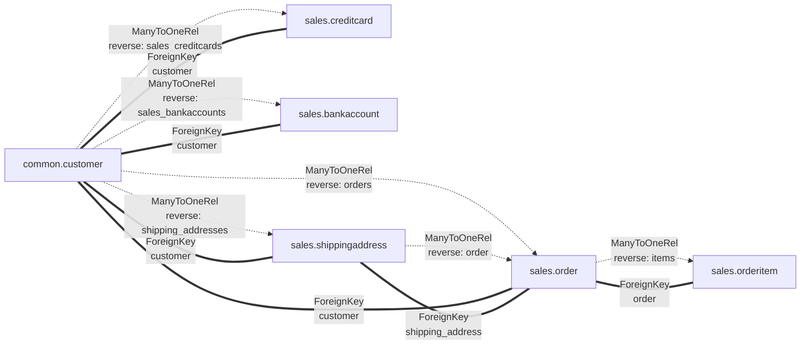
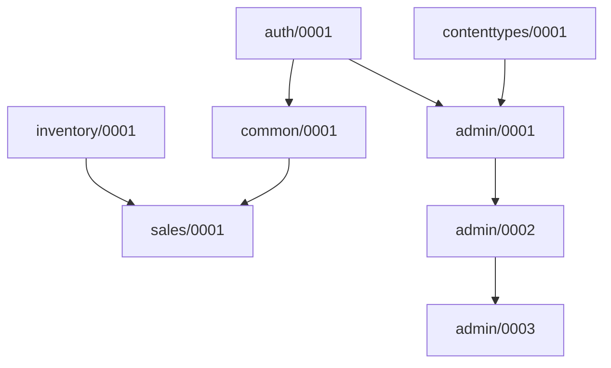

# django-model-info

[](https://badge.fury.io/py/django-model-info)
[](https://travis-ci.org/jacklinke/django-model-info)
[](https://codecov.io/gh/jacklinke/django-model-info)

**Instantly understand your Django models' structure and relationships with beautiful, intuitive output.**

Working with complex Django projects? Need to quickly understand model relationships and fields? `django-model-info` is an ideal solution for diving into any Django codebase with confidence.

## Why django-model-info?

Four django management commands provide detailed information about your models, relationships, and migrations:

- **Perfect for New Team Members**: Quickly understand existing codebases without diving through multiple files.
- **Great for Documentation**: Export beautiful HTML or Markdown documentation of your models' structure and relationships.
- **Ideal for Large Projects**: Filter by app or model to focus on what matters.
- **Time-Saving**: Instantly see model-related information without writing custom scripts.
- **Useful Output**: Leverages tools like [rich](https://github.com/willmcgugan/rich/), Markdown, MermaidJS, and Graphviz for beautiful output.

## Quick Start

1. Install the package:
```bash
pip install django-model-info
```

2. Add to INSTALLED_APPS:
```python
INSTALLED_APPS = (
    ...
    'django_model_info.apps.DjangoModelInfoConfig',
    ...
)
```

You now have access to four new management commands:
- [`modelinfo`](https://django-model-info.readthedocs.io/en/latest/modelinfo.html): Display detailed information about your models
- [`modelgraph`](https://django-model-info.readthedocs.io/en/latest/modelgraph.html): Generate a graph of your models and their relationships
- [`modelfilters`](https://django-model-info.readthedocs.io/en/latest/modelfilters.html): Understand how to filter queries for complex Django model relationships
- [`migrationgraph`](https://django-model-info.readthedocs.io/en/latest/migrationgraph.html): Visualize and understand the dependencies between migrations

## Example Outputs

### `modelinfo`

#### HTML Output

```bash
python manage.py modelinfo sales -v 3 -o modelinfo.html
```

[Rendered](https://htmlpreview.github.io/?https://github.com/OmenApps/django-model-info/blob/main/example_outputs/modelinfo.html), [Raw](https://raw.githubusercontent.com/OmenApps/django-model-info/refs/heads/main/example_outputs/modelinfo.html)

#### Markdown Output

```bash
python manage.py modelinfo sales -v 3 -o modelinfo.md
```

[Rendered](https://github.com/OmenApps/django-model-info/blob/main/example_outputs/modelinfo.md), [Raw](https://raw.githubusercontent.com/OmenApps/django-model-info/refs/heads/main/example_outputs/modelinfo.md)


### `modelfilters`

#### HTML Output

```bash
python manage.py modelfilters sales --target-model Customer ShippingAddress --target-field-type CharField -o modelfilters.html
```

[Rendered](https://htmlpreview.github.io/?https://github.com/OmenApps/django-model-info/blob/main/example_outputs/modelfilters.html), [Raw](https://raw.githubusercontent.com/OmenApps/django-model-info/refs/heads/main/example_outputs/modelfilters.html)

#### Markdown Output

```bash
python manage.py modelfilters sales --target-model Customer ShippingAddress --target-field-type CharField -o modelfilters.md
```

[Rendered](https://github.com/OmenApps/django-model-info/blob/main/example_outputs/modelfilters.md), [Raw](https://raw.githubusercontent.com/OmenApps/django-model-info/refs/heads/main/example_outputs/modelfilters.md)

### `modelgraph`

#### Analysis Output

```bash
python manage.py modelgraph
```

Output:

```
Model Graph Analysis
===================

Basic Statistics:
  Models: 5
  Relationships: 4

Isolated Models:
  - sales.bankaccount
  - sales.creditcard

Model Relationships:

  sales.order:
    ← sales.orderitem
      ManyToOneRel (reverse: items)
    → sales.shippingaddress
      ForeignKey (shipping_address)

  sales.orderitem:
    → sales.order
      ForeignKey (order)

  sales.shippingaddress:
    ← sales.order
      ManyToOneRel (reverse: order)
```

#### MermaidJS Output

```bash
python manage.py modelgraph sales -f mermaid
```

Result:

`````

`````

[](https://mermaid-js.github.io/mermaid-live-editor/edit#pako:eNqtlVFvgjAQx78KuWckyiYyMnxa9rItS9yeNhZT6Slk0JICy5zxu6-iKDI0UsZTud79-8td77oCn1MEBxaCJIH2OPGYJj-fxzFnUz9PMx6j6BmaB0-ELV_5M8MJRrczMRb4hSJFR0tJhOnUF0jDzCeCph5oRm9cNzcqv3uwtRilxYOPrWc9XroWJqMiWfoq8M4I-yS-z3OWHQFX7GrEFYE9clVUjTkIkyRkiymhVGCa4hFzubvbVOOuiezZ6-JK_FxQuagyFxY10iJ0z7cVOlkD15Vc91xguGAPuNxQHWQ113Vrp_9DKVtc6i50Sq1xWXLPFzPMMP5by421XZX2YcdehVCDZ5dcnYNRylADTL1Ht1BnOvTSPLXtzFp2G1B3pxz4Kt2oVJs2_BdMihODonM62mB2uW4dZ2njFQQd5CImIZXP9WoT50EWYIweOHJJcU7ySM4kj62lK8kz_rJkPjiZyFGHPKEkw7uQyIc-BmdOolRaE8LeOI9LJ_kLzgq-wRnYpjEwLWs0tGx7eGMOTB2W4JijkWFb9tX1wO4PLbm91uGnEOgbQx0EzxfBTnz9C6zF_mg)

#### Dot Output

```bash
python manage.py modelgraph -f dot -o modelgraph.dot
```

[Dot File](https://github.com/OmenApps/django-model-info/blob/main/example_outputs/modelgraph.dot)

[](https://edotor.net/?engine=dot#digraph%20%7B%0A%09graph%20%5Bbb%3D%220%2C0%2C3733.3%2C1167%22%2C%0A%09%09rankdir%3DLR%0A%09%5D%3B%0A%09node%20%5Blabel%3D%22%5CN%22%5D%3B%0A%09subgraph%20cluster_legend%20%7B%0A%09%09graph%20%5Bbb%3D%2228.54%2C438%2C490.32%2C599%22%2C%0A%09%09%09label%3DLegend%2C%0A%09%09%09lheight%3D0.21%2C%0A%09%09%09lp%3D%22259.43%2C587.5%22%2C%0A%09%09%09lwidth%3D0.74%2C%0A%09%09%09rankdir%3DLR%0A%09%09%5D%3B%0A%09%09key%09%5Bheight%3D1.6944%2C%0A%09%09%09label%3D%3C%3Ctable%20border%3D%220%22%20cellpadding%3D%222%22%20cellspacing%3D%220%22%20cellborder%3D%220%22%3E%0A%20%20%20%20%20%20%20%20%20%20%20%20%3Ctr%3E%3Ctd%20align%3D%22right%22%20port%3D%22i1%22%3EOneToOneField%20%3C%2Ftd%3E%3C%2Ftr%3E%0A%20%20%20%20%20%20%20%20%20%20%20%20%3Ctr%3E%3Ctd%20align%3D%22right%22%20port%3D%22i2%22%3EOneToOneRel%20%3C%2Ftd%3E%3C%2Ftr%3E%0A%20%20%20%20%20%20%20%20%20%20%20%20%3Ctr%3E%3Ctd%20align%3D%22right%22%20port%3D%22i3%22%3EForeignKey%20%3C%2Ftd%3E%3C%2Ftr%3E%0A%20%20%20%20%20%20%20%20%20%20%20%20%3Ctr%3E%3Ctd%20align%3D%22right%22%20port%3D%22i4%22%3EManyToOneRel%20%3C%2Ftd%3E%3C%2Ftr%3E%0A%20%20%20%20%20%20%20%20%20%20%20%20%3Ctr%3E%3Ctd%20align%3D%22right%22%20port%3D%22i5%22%3EManyToManyField%20%3C%2Ftd%3E%3C%2Ftr%3E%0A%20%20%20%20%20%20%20%20%20%20%20%20%3Ctr%3E%3Ctd%20align%3D%22right%22%20port%3D%22i6%22%3EManyToManyRel%20%3C%2Ftd%3E%3C%2Ftr%3E%0A%20%20%20%20%20%20%20%20%20%20%20%20%3C%2Ftable%3E%3E%2C%0A%09%09%09pos%3D%22115.04%2C507%22%2C%0A%09%09%09shape%3Dplaintext%2C%0A%09%09%09width%3D2.1806%5D%3B%0A%09%09key2%09%5Bheight%3D1.6944%2C%0A%09%09%09label%3D%3C%3Ctable%20border%3D%220%22%20cellpadding%3D%222%22%20cellspacing%3D%220%22%20cellborder%3D%220%22%3E%0A%20%20%20%20%20%20%20%20%20%20%20%20%3Ctr%3E%3Ctd%20port%3D%22i1%22%3E%26nbsp%3B%3C%2Ftd%3E%3C%2Ftr%3E%0A%20%20%20%20%20%20%20%20%20%20%20%20%3Ctr%3E%3Ctd%20port%3D%22i2%22%3E%26nbsp%3B%3C%2Ftd%3E%3C%2Ftr%3E%0A%20%20%20%20%20%20%20%20%20%20%20%20%3Ctr%3E%3Ctd%20port%3D%22i3%22%3E%26nbsp%3B%3C%2Ftd%3E%3C%2Ftr%3E%0A%20%20%20%20%20%20%20%20%20%20%20%20%3Ctr%3E%3Ctd%20port%3D%22i4%22%3E%26nbsp%3B%3C%2Ftd%3E%3C%2Ftr%3E%0A%20%20%20%20%20%20%20%20%20%20%20%20%3Ctr%3E%3Ctd%20port%3D%22i5%22%3E%26nbsp%3B%3C%2Ftd%3E%3C%2Ftr%3E%0A%20%20%20%20%20%20%20%20%20%20%20%20%3Ctr%3E%3Ctd%20port%3D%22i6%22%3E%26nbsp%3B%3C%2Ftd%3E%3C%2Ftr%3E%0A%20%20%20%20%20%20%20%20%20%20%20%20%3C%2Ftable%3E%3E%2C%0A%09%09%09pos%3D%22455.32%2C507%22%2C%0A%09%09%09shape%3Dplaintext%2C%0A%09%09%09width%3D0.75%5D%3B%0A%09%09key%3Ai1%3Ae%20-%3E%20key2%3Ai1%3Aw%09%5Bcolor%3Dchartreuse4%2C%0A%09%09%09penwidth%3D2.0%2C%0A%09%09%09pos%3D%22e%2C450.32%2C555%20187.04%2C555%20300.63%2C555%20331.52%2C555%20440.26%2C555%22%5D%3B%0A%09%09key%3Ai2%3Ae%20-%3E%20key2%3Ai2%3Aw%09%5Bcolor%3Dchartreuse4%2C%0A%09%09%09pos%3D%22e%2C450.32%2C536%20187.04%2C536%20300.63%2C536%20331.52%2C536%20440.26%2C536%22%2C%0A%09%09%09style%3Ddashed%5D%3B%0A%09%09key%3Ai3%3Ae%20-%3E%20key2%3Ai3%3Aw%09%5Bcolor%3Dblue%2C%0A%09%09%09penwidth%3D2.0%2C%0A%09%09%09pos%3D%22e%2C450.32%2C517%20187.04%2C517%20300.63%2C517%20331.52%2C517%20440.26%2C517%22%5D%3B%0A%09%09key%3Ai4%3Ae%20-%3E%20key2%3Ai4%3Aw%09%5Bcolor%3Dblue%2C%0A%09%09%09pos%3D%22e%2C450.32%2C497%20187.04%2C497%20300.63%2C497%20331.52%2C497%20440.26%2C497%22%2C%0A%09%09%09style%3Ddashed%5D%3B%0A%09%09key%3Ai5%3Ae%20-%3E%20key2%3Ai5%3Aw%09%5Bcolor%3Dred%2C%0A%09%09%09penwidth%3D2.0%2C%0A%09%09%09pos%3D%22e%2C450.32%2C478%20187.04%2C478%20300.63%2C478%20331.52%2C478%20440.26%2C478%22%5D%3B%0A%09%09key%3Ai6%3Ae%20-%3E%20key2%3Ai6%3Aw%09%5Bcolor%3Dred%2C%0A%09%09%09pos%3D%22e%2C450.32%2C459%20187.04%2C459%20300.63%2C459%20331.52%2C459%20440.26%2C459%22%2C%0A%09%09%09style%3Ddashed%5D%3B%0A%09%7D%0A%09%22admin.logentry%22%09%5Bheight%3D0.5%2C%0A%09%09model%3D%3Cclass%20'django.contrib.admin.models.LogEntry'%3E%2C%0A%09%09pos%3D%22115.04%2C63%22%2C%0A%09%09width%3D2.2567%5D%3B%0A%09%22auth.user%22%09%5Bheight%3D0.5%2C%0A%09%09model%3D%3Cclass%20'django.contrib.auth.models.User'%3E%2C%0A%09%09pos%3D%22455.32%2C405%22%2C%0A%09%09width%3D1.5346%5D%3B%0A%09%22admin.logentry%22%20-%3E%20%22auth.user%22%09%5Bkey%3Dforward%2C%0A%09%09arrowhead%3Dnormal%2C%0A%09%09color%3Dblue%2C%0A%09%09direction%3Dforward%2C%0A%09%09field_name%3Duser%2C%0A%09%09label%3D%22ForeignKey%5Cnuser%22%2C%0A%09%09lp%3D%22315.08%2C363%22%2C%0A%09%09penwidth%3D2.0%2C%0A%09%09pos%3D%22e%2C431.14%2C388.65%20174.73%2C75.235%20194.96%2C82.236%20216.04%2C93.131%20230.08%2C110%20254.79%2C139.68%20229.82%2C160.97%20248.08%2C195%20291.87%2C276.6%20377.01%2C%5C%0A347.9%20423.02%2C382.6%22%2C%0A%09%09relationship_type%3DForeignKey%2C%0A%09%09style%3Dsolid%5D%3B%0A%09%22contenttypes.contenttype%22%09%5Bheight%3D0.5%2C%0A%09%09model%3D%3Cclass%20'django.contrib.contenttypes.models.ContentType'%3E%2C%0A%09%09pos%3D%222249.9%2C70%22%2C%0A%09%09width%3D3.6108%5D%3B%0A%09%22admin.logentry%22%20-%3E%20%22contenttypes.contenttype%22%09%5Bkey%3Dforward%2C%0A%09%09arrowhead%3Dnormal%2C%0A%09%09color%3Dblue%2C%0A%09%09direction%3Dforward%2C%0A%09%09field_name%3Dcontent_type%2C%0A%09%09label%3D%22ForeignKey%5Cncontent_type%22%2C%0A%09%09lp%3D%221009.5%2C68%22%2C%0A%09%09penwidth%3D2.0%2C%0A%09%09pos%3D%22e%2C2127.9%2C63.718%20194.63%2C59.361%20263.18%2C56.502%20365.31%2C53%20454.32%2C53%20454.32%2C53%20454.32%2C53%201736.7%2C53%201866.3%2C53%202014.3%2C58.503%202117.7%2C63.247%22%2C%0A%09%09relationship_type%3DForeignKey%2C%0A%09%09style%3Dsolid%5D%3B%0A%09%22analytics.dailyrevenue%22%09%5Bheight%3D0.5%2C%0A%09%09model%3D%3Cclass%20'example_project.analytics.models.DailyRevenue'%3E%2C%0A%09%09pos%3D%22115.04%2C137%22%2C%0A%09%09width%3D3.1955%5D%3B%0A%09%22analytics.productperformance%22%09%5Bheight%3D0.5%2C%0A%09%09model%3D%3Cclass%20'example_project.analytics.models.ProductPerformance'%3E%2C%0A%09%09pos%3D%223169.3%2C1117%22%2C%0A%09%09width%3D4.1705%5D%3B%0A%09%22inventory.product%22%09%5Bheight%3D0.5%2C%0A%09%09model%3D%3Cclass%20'example_project.inventory.models.Product'%3E%2C%0A%09%09pos%3D%222664.3%2C917%22%2C%0A%09%09width%3D2.5817%5D%3B%0A%09%22analytics.productperformance%22%20-%3E%20%22inventory.product%22%09%5Bkey%3Dforward%2C%0A%09%09arrowhead%3Dnormal%2C%0A%09%09color%3Dblue%2C%0A%09%09direction%3Dforward%2C%0A%09%09field_name%3Dproduct%2C%0A%09%09label%3D%22ForeignKey%5Cnproduct%22%2C%0A%09%09lp%3D%222888.2%2C1074%22%2C%0A%09%09penwidth%3D2.0%2C%0A%09%09pos%3D%22e%2C2679.9%2C935.03%203050.8%2C1105.9%203039.5%2C1101.9%203028.8%2C1096.7%203019.2%2C1090%203006.2%2C1080.8%203014.2%2C1068.2%203001.2%2C1059%202917.8%2C999.67%202866.9%2C%5C%0A1060.4%202775.2%2C1015%202739.7%2C997.43%202707%2C965.29%202686.6%2C942.62%22%2C%0A%09%09relationship_type%3DForeignKey%2C%0A%09%09style%3Dsolid%5D%3B%0A%09%22analytics.salesmetrics%22%09%5Bheight%3D0.5%2C%0A%09%09model%3D%3Cclass%20'example_project.analytics.models.SalesMetrics'%3E%2C%0A%09%09pos%3D%22115.04%2C230%22%2C%0A%09%09width%3D3.1594%5D%3B%0A%09%22auth.group%22%09%5Bheight%3D0.5%2C%0A%09%09model%3D%3Cclass%20'django.contrib.auth.models.Group'%3E%2C%0A%09%09pos%3D%22783.76%2C278%22%2C%0A%09%09width%3D1.7151%5D%3B%0A%09%22auth.group_permissions%22%09%5Bheight%3D0.5%2C%0A%09%09model%3D%3Cclass%20'django.contrib.auth.models.Group_permissions'%3E%2C%0A%09%09pos%3D%221265%2C176%22%2C%0A%09%09width%3D3.3941%5D%3B%0A%09%22auth.group%22%20-%3E%20%22auth.group_permissions%22%09%5Bkey%3Dreverse%2C%0A%09%09arrowhead%3Dnormal%2C%0A%09%09color%3Dblue%2C%0A%09%09direction%3Dback%2C%0A%09%09field_name%3D%22Group_permissions%2B%22%2C%0A%09%09label%3D%22ManyToOneRel%5Cn(reverse%3A%20Group_permissions%2B)%22%2C%0A%09%09lp%3D%221009.5%2C175%22%2C%0A%09%09penwidth%3D1.0%2C%0A%09%09pos%3D%22e%2C1176.4%2C163.57%20795.18%2C260.11%20812.45%2C232.48%20849.91%2C180.49%20897.95%2C160%20944.48%2C140.16%201074.4%2C151.15%201166.2%2C162.31%22%2C%0A%09%09relationship_type%3DManyToOneRel%2C%0A%09%09style%3Ddashed%5D%3B%0A%09%22auth.permission%22%09%5Bheight%3D0.5%2C%0A%09%09model%3D%3Cclass%20'django.contrib.auth.models.Permission'%3E%2C%0A%09%09pos%3D%221735.7%2C224%22%2C%0A%09%09width%3D2.3831%5D%3B%0A%09%22auth.group%22%20-%3E%20%22auth.permission%22%09%5Bkey%3Dforward%2C%0A%09%09arrowhead%3Dnormal%2C%0A%09%09color%3Dred%2C%0A%09%09direction%3Dforward%2C%0A%09%09field_name%3Dpermissions%2C%0A%09%09label%3D%22ManyToManyField%5Cnpermissions%22%2C%0A%09%09lp%3D%221265%2C274%22%2C%0A%09%09penwidth%3D2.0%2C%0A%09%09pos%3D%22e%2C1656.8%2C231.12%20844.38%2C274.2%20861.66%2C273.13%20880.56%2C271.99%20897.95%2C271%201224.1%2C252.47%201306.1%2C255.69%201632%2C233%201636.7%2C232.67%201641.6%2C232.31%20%5C%0A1646.6%2C231.93%22%2C%0A%09%09relationship_type%3DManyToManyField%2C%0A%09%09style%3Dsolid%5D%3B%0A%09%22auth.group%22%20-%3E%20%22auth.user%22%09%5Bkey%3Dreverse%2C%0A%09%09arrowhead%3Dnormal%2C%0A%09%09color%3Dred%2C%0A%09%09direction%3Dback%2C%0A%09%09field_name%3Duser%2C%0A%09%09label%3D%22ManyToManyRel%5Cn(reverse%3A%20user)%22%2C%0A%09%09lp%3D%22599.07%2C343%22%2C%0A%09%09penwidth%3D1.0%2C%0A%09%09pos%3D%22e%2C467.79%2C387.13%20736.67%2C289.79%20716.19%2C294.83%20691.75%2C300.55%20669.57%2C305%20607.31%2C317.49%20584.61%2C298.15%20528.57%2C328%20506.25%2C339.89%20487.01%2C%5C%0A361.33%20474.01%2C378.57%22%2C%0A%09%09relationship_type%3DManyToManyRel%2C%0A%09%09style%3Ddashed%5D%3B%0A%09%22auth.user_groups%22%09%5Bheight%3D0.5%2C%0A%09%09model%3D%3Cclass%20'django.contrib.auth.models.User_groups'%3E%2C%0A%09%09pos%3D%221265%2C396%22%2C%0A%09%09width%3D2.5456%5D%3B%0A%09%22auth.group%22%20-%3E%20%22auth.user_groups%22%09%5Bkey%3Dreverse%2C%0A%09%09arrowhead%3Dnormal%2C%0A%09%09color%3Dblue%2C%0A%09%09direction%3Dback%2C%0A%09%09field_name%3D%22User_groups%2B%22%2C%0A%09%09label%3D%22ManyToOneRel%5Cn(reverse%3A%20User_groups%2B)%22%2C%0A%09%09lp%3D%221009.5%2C331%22%2C%0A%09%09penwidth%3D1.0%2C%0A%09%09pos%3D%22e%2C1205.8%2C382.14%20839.99%2C285.64%20858.41%2C288.11%20879.05%2C290.77%20897.95%2C293%20947.43%2C298.83%201079.1%2C288.96%201121%2C316%201134.3%2C324.65%201126.9%2C336.63%20%5C%0A1139%2C347%201155.3%2C361.02%201176.1%2C371.31%201196.1%2C378.72%22%2C%0A%09%09relationship_type%3DManyToOneRel%2C%0A%09%09style%3Ddashed%5D%3B%0A%09%22auth.group_permissions%22%20-%3E%20%22auth.group%22%09%5Bkey%3Dforward%2C%0A%09%09arrowhead%3Dnormal%2C%0A%09%09color%3Dblue%2C%0A%09%09direction%3Dforward%2C%0A%09%09field_name%3Dgroup%2C%0A%09%09label%3D%22ForeignKey%5Cngroup%22%2C%0A%09%09lp%3D%221009.5%2C228%22%2C%0A%09%09penwidth%3D2.0%2C%0A%09%09pos%3D%22e%2C807.26%2C261.24%201162.7%2C185.98%201055.4%2C196.59%20901.12%2C211.98%20897.95%2C213%20868.18%2C222.57%20837.62%2C240.71%20815.77%2C255.4%22%2C%0A%09%09relationship_type%3DForeignKey%2C%0A%09%09style%3Dsolid%5D%3B%0A%09%22auth.group_permissions%22%20-%3E%20%22auth.permission%22%09%5Bkey%3Dforward%2C%0A%09%09arrowhead%3Dnormal%2C%0A%09%09color%3Dblue%2C%0A%09%09direction%3Dforward%2C%0A%09%09field_name%3Dpermission%2C%0A%09%09label%3D%22ForeignKey%5Cnpermission%22%2C%0A%09%09lp%3D%221520.5%2C165%22%2C%0A%09%09penwidth%3D2.0%2C%0A%09%09pos%3D%22e%2C1717.4%2C206.15%201319.6%2C159.89%201392.3%2C140.78%201525.2%2C115.59%201632%2C150%201661.9%2C159.67%201690.6%2C181.69%201709.9%2C199.21%22%2C%0A%09%09relationship_type%3DForeignKey%2C%0A%09%09style%3Dsolid%5D%3B%0A%09%22auth.permission%22%20-%3E%20%22auth.group%22%09%5Bkey%3Dreverse%2C%0A%09%09arrowhead%3Dnormal%2C%0A%09%09color%3Dred%2C%0A%09%09direction%3Dback%2C%0A%09%09field_name%3Dgroup%2C%0A%09%09label%3D%22ManyToManyRel%5Cn(reverse%3A%20group)%22%2C%0A%09%09lp%3D%221265%2C309%22%2C%0A%09%09penwidth%3D1.0%2C%0A%09%09pos%3D%22e%2C844.91%2C280.88%201688%2C239.05%201670.5%2C244.3%201650.5%2C249.9%201632%2C254%201417.4%2C301.55%201358.6%2C295.03%201139%2C291%201040.4%2C289.19%20926.59%2C284.56%20%5C%0A855.13%2C281.34%22%2C%0A%09%09relationship_type%3DManyToManyRel%2C%0A%09%09style%3Ddashed%5D%3B%0A%09%22auth.permission%22%20-%3E%20%22auth.group_permissions%22%09%5Bkey%3Dreverse%2C%0A%09%09arrowhead%3Dnormal%2C%0A%09%09color%3Dblue%2C%0A%09%09direction%3Dback%2C%0A%09%09field_name%3D%22Group_permissions%2B%22%2C%0A%09%09label%3D%22ManyToOneRel%5Cn(reverse%3A%20Group_permissions%2B)%22%2C%0A%09%09lp%3D%221520.5%2C218%22%2C%0A%09%09penwidth%3D1.0%2C%0A%09%09pos%3D%22e%2C1383%2C180.82%201676.8%2C210.81%201662.2%2C207.87%201646.6%2C205.02%201632%2C203%201553%2C192.07%201463.8%2C185.37%201393.2%2C181.38%22%2C%0A%09%09relationship_type%3DManyToOneRel%2C%0A%09%09style%3Ddashed%5D%3B%0A%09%22auth.permission%22%20-%3E%20%22auth.user%22%09%5Bkey%3Dreverse%2C%0A%09%09arrowhead%3Dnormal%2C%0A%09%09color%3Dred%2C%0A%09%09direction%3Dback%2C%0A%09%09field_name%3Duser%2C%0A%09%09label%3D%22ManyToManyRel%5Cn(reverse%3A%20user)%22%2C%0A%09%09lp%3D%221009.5%2C131%22%2C%0A%09%09penwidth%3D1.0%2C%0A%09%09pos%3D%22e%2C459.49%2C386.91%201721.9%2C205.9%201704.5%2C183.08%201671.1%2C144.91%201632%2C129%201543.6%2C93.118%201043.5%2C91.685%20897.95%2C116%20726.72%2C144.61%20656.63%2C125.78%20%5C%0A528.57%2C243%20488.98%2C279.24%20469.81%2C341.23%20461.61%2C377.1%22%2C%0A%09%09relationship_type%3DManyToManyRel%2C%0A%09%09style%3Ddashed%5D%3B%0A%09%22auth.user_user_permissions%22%09%5Bheight%3D0.5%2C%0A%09%09model%3D%3Cclass%20'django.contrib.auth.models.User_user_permissions'%3E%2C%0A%09%09pos%3D%222249.9%2C451%22%2C%0A%09%09width%3D3.8997%5D%3B%0A%09%22auth.permission%22%20-%3E%20%22auth.user_user_permissions%22%09%5Bkey%3Dreverse%2C%0A%09%09arrowhead%3Dnormal%2C%0A%09%09color%3Dblue%2C%0A%09%09direction%3Dback%2C%0A%09%09field_name%3D%22User_user_permissions%2B%22%2C%0A%09%09label%3D%22ManyToOneRel%5Cn(reverse%3A%20User_user_permissions%2B)%22%2C%0A%09%09lp%3D%221965.5%2C421%22%2C%0A%09%09penwidth%3D1.0%2C%0A%09%09pos%3D%22e%2C2186.4%2C434.91%201755.9%2C241.7%201775.7%2C259.17%201808%2C285.7%201839.5%2C303%201951%2C364.03%202092.6%2C408.72%202176.7%2C432.22%22%2C%0A%09%09relationship_type%3DManyToOneRel%2C%0A%09%09style%3Ddashed%5D%3B%0A%09%22auth.permission%22%20-%3E%20%22contenttypes.contenttype%22%09%5Bkey%3Dforward%2C%0A%09%09arrowhead%3Dnormal%2C%0A%09%09color%3Dblue%2C%0A%09%09direction%3Dforward%2C%0A%09%09field_name%3Dcontent_type%2C%0A%09%09label%3D%22ForeignKey%5Cncontent_type%22%2C%0A%09%09lp%3D%221965.5%2C206%22%2C%0A%09%09penwidth%3D2.0%2C%0A%09%09pos%3D%22e%2C2194.6%2C86.335%201785.9%2C209.23%201879%2C181.23%202081.2%2C120.42%202184.9%2C89.256%22%2C%0A%09%09relationship_type%3DForeignKey%2C%0A%09%09style%3Dsolid%5D%3B%0A%09%22auth.user%22%20-%3E%20%22admin.logentry%22%09%5Bkey%3Dreverse%2C%0A%09%09arrowhead%3Dnormal%2C%0A%09%09color%3Dblue%2C%0A%09%09direction%3Dback%2C%0A%09%09field_name%3Dlogentry%2C%0A%09%09label%3D%22ManyToOneRel%5Cn(reverse%3A%20logentry)%22%2C%0A%09%09lp%3D%22315.08%2C176%22%2C%0A%09%09penwidth%3D1.0%2C%0A%09%09pos%3D%22e%2C187.06%2C71.402%20454.21%2C386.7%20452.94%2C342.09%20443.55%2C226.61%20382.08%2C161%20333.8%2C109.47%20256.09%2C84.922%20197.1%2C73.293%22%2C%0A%09%09relationship_type%3DManyToOneRel%2C%0A%09%09style%3Ddashed%5D%3B%0A%09%22auth.user%22%20-%3E%20%22auth.group%22%09%5Bkey%3Dforward%2C%0A%09%09arrowhead%3Dnormal%2C%0A%09%09color%3Dred%2C%0A%09%09direction%3Dforward%2C%0A%09%09field_name%3Dgroups%2C%0A%09%09label%3D%22ManyToManyField%5Cngroups%22%2C%0A%09%09lp%3D%22599.07%2C286%22%2C%0A%09%09penwidth%3D2.0%2C%0A%09%09pos%3D%22e%2C742.45%2C264.45%20459.88%2C387.05%20466.94%2C356.8%20485.91%2C296.47%20528.57%2C271%20591.02%2C233.72%20678.36%2C247.32%20732.7%2C261.76%22%2C%0A%09%09relationship_type%3DManyToManyField%2C%0A%09%09style%3Dsolid%5D%3B%0A%09%22auth.user%22%20-%3E%20%22auth.permission%22%09%5Bkey%3Dforward%2C%0A%09%09arrowhead%3Dnormal%2C%0A%09%09color%3Dred%2C%0A%09%09direction%3Dforward%2C%0A%09%09field_name%3Duser_permissions%2C%0A%09%09label%3D%22ManyToManyField%5Cnuser_permissions%22%2C%0A%09%09lp%3D%221009.5%2C487%22%2C%0A%09%09penwidth%3D2.0%2C%0A%09%09pos%3D%22e%2C1712.7%2C241.65%20489.74%2C419.28%20501.82%2C424.08%20515.67%2C429.19%20528.57%2C433%20597.79%2C453.44%20615.77%2C458.63%20687.57%2C466%20843.35%2C482%201241.3%2C469.11%20%5C%0A1391%2C423%201517.3%2C384.08%201647.1%2C291.9%201704.5%2C248.02%22%2C%0A%09%09relationship_type%3DManyToManyField%2C%0A%09%09style%3Dsolid%5D%3B%0A%09%22auth.user%22%20-%3E%20%22auth.user_groups%22%09%5Bkey%3Dreverse%2C%0A%09%09arrowhead%3Dnormal%2C%0A%09%09color%3Dblue%2C%0A%09%09direction%3Dback%2C%0A%09%09field_name%3D%22User_groups%2B%22%2C%0A%09%09label%3D%22ManyToOneRel%5Cn(reverse%3A%20User_groups%2B)%22%2C%0A%09%09lp%3D%22783.76%2C447%22%2C%0A%09%09penwidth%3D1.0%2C%0A%09%09pos%3D%22e%2C1206.2%2C409.94%20507.76%2C410.84%20619.6%2C422.57%20893.17%2C446.09%201121%2C424%201145.7%2C421.6%201172.6%2C416.9%201196.3%2C412.03%22%2C%0A%09%09relationship_type%3DManyToOneRel%2C%0A%09%09style%3Ddashed%5D%3B%0A%09%22auth.user%22%20-%3E%20%22auth.user_user_permissions%22%09%5Bkey%3Dreverse%2C%0A%09%09arrowhead%3Dnormal%2C%0A%09%09color%3Dblue%2C%0A%09%09direction%3Dback%2C%0A%09%09field_name%3D%22User_user_permissions%2B%22%2C%0A%09%09label%3D%22ManyToOneRel%5Cn(reverse%3A%20User_user_permissions%2B)%22%2C%0A%09%09lp%3D%221265%2C615%22%2C%0A%09%09penwidth%3D1.0%2C%0A%09%09pos%3D%22e%2C2226.7%2C468.8%20492.65%2C418.37%20499.52%2C422.42%20505.99%2C427.56%20510.57%2C434%20540.3%2C475.8%20493.13%2C510.92%20528.57%2C548%20608.25%2C631.36%20667.45%2C600%20%5C%0A782.76%2C600%20782.76%2C600%20782.76%2C600%201736.7%2C600%201896.1%2C600%201941.8%2C602.49%202091.5%2C548%202139.4%2C530.6%202188.3%2C497.53%202218.7%2C474.89%22%2C%0A%09%09relationship_type%3DManyToOneRel%2C%0A%09%09style%3Ddashed%5D%3B%0A%09%22common.customer%22%09%5Bheight%3D0.5%2C%0A%09%09model%3D%3Cclass%20'example_project.common.models.Customer'%3E%2C%0A%09%09pos%3D%22783.76%2C765%22%2C%0A%09%09width%3D2.672%5D%3B%0A%09%22auth.user%22%20-%3E%20%22common.customer%22%09%5Bkey%3Dreverse%2C%0A%09%09arrowhead%3Dnormal%2C%0A%09%09color%3Dchartreuse4%2C%0A%09%09direction%3Dback%2C%0A%09%09field_name%3Dcustomer%2C%0A%09%09label%3D%22OneToOneRel%5Cn(reverse%3A%20customer)%22%2C%0A%09%09lp%3D%22599.07%2C775%22%2C%0A%09%09penwidth%3D1.0%2C%0A%09%09pos%3D%22e%2C687.54%2C763.66%20493.36%2C418.24%20500.1%2C422.29%20506.33%2C427.46%20510.57%2C434%20541.93%2C482.43%20492.2%2C648.21%20528.57%2C693%20564.22%2C736.9%20624.5%2C755.22%20%5C%0A677.41%2C762.41%22%2C%0A%09%09relationship_type%3DOneToOneRel%2C%0A%09%09style%3Ddashed%5D%3B%0A%09%22auth.user_groups%22%20-%3E%20%22auth.group%22%09%5Bkey%3Dforward%2C%0A%09%09arrowhead%3Dnormal%2C%0A%09%09color%3Dblue%2C%0A%09%09direction%3Dforward%2C%0A%09%09field_name%3Dgroup%2C%0A%09%09label%3D%22ForeignKey%5Cngroup%22%2C%0A%09%09lp%3D%221009.5%2C384%22%2C%0A%09%09penwidth%3D2.0%2C%0A%09%09pos%3D%22e%2C806.31%2C294.92%201201.1%2C382.96%201176.3%2C378.1%201147.3%2C372.84%201121%2C369%201022.4%2C354.63%20992.47%2C377.52%20897.95%2C346%20867.43%2C335.82%20836.35%2C316.36%20%5C%0A814.5%2C300.86%22%2C%0A%09%09relationship_type%3DForeignKey%2C%0A%09%09style%3Dsolid%5D%3B%0A%09%22auth.user_groups%22%20-%3E%20%22auth.user%22%09%5Bkey%3Dforward%2C%0A%09%09arrowhead%3Dnormal%2C%0A%09%09color%3Dblue%2C%0A%09%09direction%3Dforward%2C%0A%09%09field_name%3Duser%2C%0A%09%09label%3D%22ForeignKey%5Cnuser%22%2C%0A%09%09lp%3D%22783.76%2C408%22%2C%0A%09%09penwidth%3D2.0%2C%0A%09%09pos%3D%22e%2C509.57%2C401.45%201173.9%2C398.18%201156.4%2C398.52%201138.1%2C398.82%201121%2C399%201021.8%2C400.04%20995.78%2C414.88%20897.95%2C399%20889.63%2C397.65%20888.28%2C394.35%20%5C%0A879.95%2C393%20795.55%2C379.3%20773.04%2C390.78%20687.57%2C393%20630.78%2C394.47%20566.22%2C397.98%20519.78%2C400.82%22%2C%0A%09%09relationship_type%3DForeignKey%2C%0A%09%09style%3Dsolid%5D%3B%0A%09%22auth.user_user_permissions%22%20-%3E%20%22auth.permission%22%09%5Bkey%3Dforward%2C%0A%09%09arrowhead%3Dnormal%2C%0A%09%09color%3Dblue%2C%0A%09%09direction%3Dforward%2C%0A%09%09field_name%3Dpermission%2C%0A%09%09label%3D%22ForeignKey%5Cnpermission%22%2C%0A%09%09lp%3D%221965.5%2C284%22%2C%0A%09%09penwidth%3D2.0%2C%0A%09%09pos%3D%22e%2C1819.8%2C227.7%202239.4%2C432.94%202218.4%2C395.14%202164.3%2C307.97%202091.5%2C269%202047.7%2C245.49%201919.6%2C233.78%201830%2C228.31%22%2C%0A%09%09relationship_type%3DForeignKey%2C%0A%09%09style%3Dsolid%5D%3B%0A%09%22auth.user_user_permissions%22%20-%3E%20%22auth.user%22%09%5Bkey%3Dforward%2C%0A%09%09arrowhead%3Dnormal%2C%0A%09%09color%3Dblue%2C%0A%09%09direction%3Dforward%2C%0A%09%09field_name%3Duser%2C%0A%09%09label%3D%22ForeignKey%5Cnuser%22%2C%0A%09%09lp%3D%221265%2C549%22%2C%0A%09%09penwidth%3D2.0%2C%0A%09%09pos%3D%22e%2C489.37%2C419.22%202188.7%2C467.2%202093.5%2C491.35%201902%2C534%201736.7%2C534%20782.76%2C534%20782.76%2C534%20782.76%2C534%20665.34%2C534%20622.91%2C531.91%20528.57%2C%5C%0A462%20516.68%2C453.19%20521.44%2C444.03%20510.57%2C434%20506.79%2C430.51%20502.52%2C427.31%20498.06%2C424.41%22%2C%0A%09%09relationship_type%3DForeignKey%2C%0A%09%09style%3Dsolid%5D%3B%0A%09%22common.customer%22%20-%3E%20%22auth.user%22%09%5Bkey%3Dforward%2C%0A%09%09arrowhead%3Dnormal%2C%0A%09%09color%3Dchartreuse4%2C%0A%09%09direction%3Dforward%2C%0A%09%09field_name%3Duser%2C%0A%09%09label%3D%22OneToOneField%5Cnuser%22%2C%0A%09%09lp%3D%22599.07%2C674%22%2C%0A%09%09penwidth%3D2.0%2C%0A%09%09pos%3D%22e%2C493.21%2C418.34%20768.14%2C747.04%20748.18%2C723.63%20710.2%2C682.85%20669.57%2C659%20612.84%2C625.7%20569.97%2C665.12%20528.57%2C614%20477.97%2C551.52%20555.28%2C500.82%20%5C%0A510.57%2C434%20508.13%2C430.36%20505.08%2C427.13%20501.67%2C424.29%22%2C%0A%09%09relationship_type%3DOneToOneField%2C%0A%09%09style%3Dsolid%5D%3B%0A%09%22sales.bankaccount%22%09%5Bheight%3D0.5%2C%0A%09%09model%3D%3Cclass%20'example_project.sales.models.BankAccount'%3E%2C%0A%09%09pos%3D%221265%2C762%22%2C%0A%09%09width%3D2.6539%5D%3B%0A%09%22common.customer%22%20-%3E%20%22sales.bankaccount%22%09%5Bkey%3Dreverse%2C%0A%09%09arrowhead%3Dnormal%2C%0A%09%09color%3Dblue%2C%0A%09%09direction%3Dback%2C%0A%09%09field_name%3Dsales_bankaccounts%2C%0A%09%09label%3D%22ManyToOneRel%5Cn(reverse%3A%20sales_bankaccounts)%22%2C%0A%09%09lp%3D%221009.5%2C755%22%2C%0A%09%09penwidth%3D1.0%2C%0A%09%09pos%3D%22e%2C1196.2%2C749.41%20839.92%2C750.3%20858.24%2C746.09%20878.85%2C742.08%20897.95%2C740%20996.48%2C729.25%201022.1%2C732.44%201121%2C740%201142.2%2C741.63%201165.2%2C744.6%20%5C%0A1186.3%2C747.85%22%2C%0A%09%09relationship_type%3DManyToOneRel%2C%0A%09%09style%3Ddashed%5D%3B%0A%09%22sales.creditcard%22%09%5Bheight%3D0.5%2C%0A%09%09model%3D%3Cclass%20'example_project.sales.models.CreditCard'%3E%2C%0A%09%09pos%3D%221265%2C676%22%2C%0A%09%09width%3D2.3651%5D%3B%0A%09%22common.customer%22%20-%3E%20%22sales.creditcard%22%09%5Bkey%3Dreverse%2C%0A%09%09arrowhead%3Dnormal%2C%0A%09%09color%3Dblue%2C%0A%09%09direction%3Dback%2C%0A%09%09field_name%3Dsales_creditcards%2C%0A%09%09label%3D%22ManyToOneRel%5Cn(reverse%3A%20sales_creditcards)%22%2C%0A%09%09lp%3D%221009.5%2C649%22%2C%0A%09%09penwidth%3D1.0%2C%0A%09%09pos%3D%22e%2C1222.4%2C660.38%20793.86%2C746.68%20810%2C716.51%20846.84%2C657.38%20897.95%2C634%20988.08%2C592.76%201022.9%2C619.89%201121%2C634%201152.1%2C638.48%201185.9%2C648.17%20%5C%0A1212.8%2C657.12%22%2C%0A%09%09relationship_type%3DManyToOneRel%2C%0A%09%09style%3Ddashed%5D%3B%0A%09%22sales.order%22%09%5Bheight%3D0.5%2C%0A%09%09model%3D%3Cclass%20'example_project.sales.models.Order'%3E%2C%0A%09%09pos%3D%221735.7%2C919%22%2C%0A%09%09width%3D1.7332%5D%3B%0A%09%22common.customer%22%20-%3E%20%22sales.order%22%09%5Bkey%3Dreverse%2C%0A%09%09arrowhead%3Dnormal%2C%0A%09%09color%3Dblue%2C%0A%09%09direction%3Dback%2C%0A%09%09field_name%3Dorders%2C%0A%09%09label%3D%22ManyToOneRel%5Cn(reverse%3A%20orders)%22%2C%0A%09%09lp%3D%221265%2C915%22%2C%0A%09%09penwidth%3D1.0%2C%0A%09%09pos%3D%22e%2C1673.9%2C916.04%20801.6%2C782.87%20822.15%2C803.37%20859.01%2C836.06%20897.95%2C851%20968.57%2C878.09%201474.7%2C905.95%201663.8%2C915.53%22%2C%0A%09%09relationship_type%3DManyToOneRel%2C%0A%09%09style%3Ddashed%5D%3B%0A%09%22sales.shippingaddress%22%09%5Bheight%3D0.5%2C%0A%09%09model%3D%3Cclass%20'example_project.sales.models.ShippingAddress'%3E%2C%0A%09%09pos%3D%221265%2C979%22%2C%0A%09%09width%3D3.1594%5D%3B%0A%09%22common.customer%22%20-%3E%20%22sales.shippingaddress%22%09%5Bkey%3Dreverse%2C%0A%09%09arrowhead%3Dnormal%2C%0A%09%09color%3Dblue%2C%0A%09%09direction%3Dback%2C%0A%09%09field_name%3Dshipping_addresses%2C%0A%09%09label%3D%22ManyToOneRel%5Cn(reverse%3A%20shipping_addresses)%22%2C%0A%09%09lp%3D%221009.5%2C1022%22%2C%0A%09%09penwidth%3D1.0%2C%0A%09%09pos%3D%22e%2C1202.8%2C994.12%20788.63%2C783.15%20798.51%2C824.43%20828.92%2C925.01%20897.95%2C967%20987.76%2C1021.6%201114.2%2C1010.7%201192.5%2C996.11%22%2C%0A%09%09relationship_type%3DManyToOneRel%2C%0A%09%09style%3Ddashed%5D%3B%0A%09%22contenttypes.contenttype%22%20-%3E%20%22admin.logentry%22%09%5Bkey%3Dreverse%2C%0A%09%09arrowhead%3Dnormal%2C%0A%09%09color%3Dblue%2C%0A%09%09direction%3Dback%2C%0A%09%09field_name%3Dlogentry%2C%0A%09%09label%3D%22ManyToOneRel%5Cn(reverse%3A%20logentry)%22%2C%0A%09%09lp%3D%221009.5%2C15%22%2C%0A%09%09penwidth%3D1.0%2C%0A%09%09pos%3D%22e%2C163.42%2C48.467%202181%2C54.725%202083.3%2C34.128%201897.2%2C0%201736.7%2C0%20454.32%2C0%20454.32%2C0%20454.32%2C0%20354.17%2C0%20240.12%2C27.017%20173.32%2C45.666%22%2C%0A%09%09relationship_type%3DManyToOneRel%2C%0A%09%09style%3Ddashed%5D%3B%0A%09%22contenttypes.contenttype%22%20-%3E%20%22auth.permission%22%09%5Bkey%3Dreverse%2C%0A%09%09arrowhead%3Dnormal%2C%0A%09%09color%3Dblue%2C%0A%09%09direction%3Dback%2C%0A%09%09field_name%3Dpermission%2C%0A%09%09label%3D%22ManyToOneRel%5Cn(reverse%3A%20permission)%22%2C%0A%09%09lp%3D%221965.5%2C101%22%2C%0A%09%09penwidth%3D1.0%2C%0A%09%09pos%3D%22e%2C1743.9%2C206%202120%2C69.506%202009.3%2C69.988%201864%2C73.134%201839.5%2C86%201794.3%2C109.85%201763.6%2C163.56%201748.2%2C196.5%22%2C%0A%09%09relationship_type%3DManyToOneRel%2C%0A%09%09style%3Ddashed%5D%3B%0A%09%22inventory.category%22%09%5Bheight%3D0.5%2C%0A%09%09model%3D%3Cclass%20'example_project.inventory.models.Category'%3E%2C%0A%09%09pos%3D%223169.3%2C967%22%2C%0A%09%09width%3D2.69%5D%3B%0A%09%22inventory.category%22%20-%3E%20%22inventory.category%22%09%5Bkey%3Dreverse%2C%0A%09%09arrowhead%3Dnormal%2C%0A%09%09color%3Dblue%2C%0A%09%09direction%3Dback%2C%0A%09%09field_name%3Dchildren%2C%0A%09%09label%3D%22ManyToOneRel%5Cn(reverse%3A%20children)%22%2C%0A%09%09lp%3D%223169.3%2C1018%22%2C%0A%09%09penwidth%3D1.0%2C%0A%09%09pos%3D%22e%2C3192.9%2C984.78%203145.8%2C984.78%203141.8%2C994.31%203149.6%2C1003%203169.3%2C1003%203181.3%2C1003%203188.9%2C999.77%203192.1%2C995.1%22%2C%0A%09%09relationship_type%3DManyToOneRel%2C%0A%09%09style%3Ddashed%5D%3B%0A%09%22inventory.category%22%20-%3E%20%22inventory.category%22%09%5Bkey%3Dforward%2C%0A%09%09arrowhead%3Dnormal%2C%0A%09%09color%3Dblue%2C%0A%09%09direction%3Dforward%2C%0A%09%09field_name%3Dparent%2C%0A%09%09label%3D%22ForeignKey%5Cnparent%22%2C%0A%09%09lp%3D%223169.3%2C1048%22%2C%0A%09%09penwidth%3D2.0%2C%0A%09%09pos%3D%22e%2C3205%2C983.92%203133.7%2C983.92%203107.6%2C1005.1%203119.4%2C1033%203169.3%2C1033%203213.8%2C1033%203228.1%2C1010.9%203212.2%2C991.08%22%2C%0A%09%09relationship_type%3DForeignKey%2C%0A%09%09style%3Dsolid%5D%3B%0A%09%22inventory.category%22%20-%3E%20%22inventory.product%22%09%5Bkey%3Dreverse%2C%0A%09%09arrowhead%3Dnormal%2C%0A%09%09color%3Dblue%2C%0A%09%09direction%3Dback%2C%0A%09%09field_name%3Dproduct%2C%0A%09%09label%3D%22ManyToOneRel%5Cn(reverse%3A%20product)%22%2C%0A%09%09lp%3D%222888.2%2C950%22%2C%0A%09%09penwidth%3D1.0%2C%0A%09%09pos%3D%22e%2C2757.2%2C918.57%203106.7%2C953.14%203075.3%2C946.59%203036.4%2C939.29%203001.2%2C935%202923%2C925.47%202834%2C920.98%202767.3%2C918.87%22%2C%0A%09%09relationship_type%3DManyToOneRel%2C%0A%09%09style%3Ddashed%5D%3B%0A%09%22inventory.product%22%20-%3E%20%22analytics.productperformance%22%09%5Bkey%3Dreverse%2C%0A%09%09arrowhead%3Dnormal%2C%0A%09%09color%3Dblue%2C%0A%09%09direction%3Dback%2C%0A%09%09field_name%3Dperformance_metrics%2C%0A%09%09label%3D%22ManyToOneRel%5Cn(reverse%3A%20performance_metrics)%22%2C%0A%09%09lp%3D%222888.2%2C1152%22%2C%0A%09%09penwidth%3D1.0%2C%0A%09%09pos%3D%22e%2C3083.2%2C1131.8%202670.7%2C935.06%202682.8%2C971.53%202715.5%2C1053.5%202775.2%2C1089%202865.5%2C1142.7%202988.8%2C1142.1%203073.2%2C1132.9%22%2C%0A%09%09relationship_type%3DManyToOneRel%2C%0A%09%09style%3Ddashed%5D%3B%0A%09%22inventory.product%22%20-%3E%20%22inventory.category%22%09%5Bkey%3Dforward%2C%0A%09%09arrowhead%3Dnormal%2C%0A%09%09color%3Dblue%2C%0A%09%09direction%3Dforward%2C%0A%09%09field_name%3Dcategory%2C%0A%09%09label%3D%22ForeignKey%5Cncategory%22%2C%0A%09%09lp%3D%222888.2%2C996%22%2C%0A%09%09penwidth%3D2.0%2C%0A%09%09pos%3D%22e%2C3085.6%2C976.18%202695.4%2C934.16%202716.9%2C945.37%202746.9%2C959.01%202775.2%2C965%202876.2%2C986.36%202995.1%2C983.17%203075.5%2C976.99%22%2C%0A%09%09relationship_type%3DForeignKey%2C%0A%09%09style%3Dsolid%5D%3B%0A%09%22inventory.productsupplier%22%09%5Bheight%3D0.5%2C%0A%09%09model%3D%3Cclass%20'example_project.inventory.models.ProductSupplier'%3E%2C%0A%09%09pos%3D%223169.3%2C842%22%2C%0A%09%09width%3D3.6288%5D%3B%0A%09%22inventory.product%22%20-%3E%20%22inventory.productsupplier%22%09%5Bkey%3Dreverse%2C%0A%09%09arrowhead%3Dnormal%2C%0A%09%09color%3Dblue%2C%0A%09%09direction%3Dback%2C%0A%09%09field_name%3Dproductsupplier%2C%0A%09%09label%3D%22ManyToOneRel%5Cn(reverse%3A%20productsupplier)%22%2C%0A%09%09lp%3D%222888.2%2C872%22%2C%0A%09%09penwidth%3D1.0%2C%0A%09%09pos%3D%22e%2C3039.1%2C840.59%202689.6%2C899.4%202711%2C885.03%202743.5%2C865.72%202775.2%2C857%202821.5%2C844.24%202935.6%2C840.98%203029%2C840.62%22%2C%0A%09%09relationship_type%3DManyToOneRel%2C%0A%09%09style%3Ddashed%5D%3B%0A%09%22inventory.supplier%22%09%5Bheight%3D0.5%2C%0A%09%09model%3D%3Cclass%20'example_project.inventory.models.Supplier'%3E%2C%0A%09%09pos%3D%223638.4%2C829%22%2C%0A%09%09width%3D2.6359%5D%3B%0A%09%22inventory.product%22%20-%3E%20%22inventory.supplier%22%09%5Bkey%3Dforward%2C%0A%09%09arrowhead%3Dnormal%2C%0A%09%09color%3Dred%2C%0A%09%09direction%3Dforward%2C%0A%09%09field_name%3Dsuppliers%2C%0A%09%09label%3D%22ManyToManyField%5Cnsuppliers%22%2C%0A%09%09lp%3D%223169.3%2C918%22%2C%0A%09%09penwidth%3D2.0%2C%0A%09%09pos%3D%22e%2C3602.5%2C845.69%202756%2C913.87%202961.8%2C906.53%203451.8%2C887.66%203525.5%2C872%203548.5%2C867.1%203573%2C858.14%203593.2%2C849.66%22%2C%0A%09%09relationship_type%3DManyToManyField%2C%0A%09%09style%3Dsolid%5D%3B%0A%09%22sales.orderitem%22%09%5Bheight%3D0.5%2C%0A%09%09model%3D%3Cclass%20'example_project.sales.models.OrderItem'%3E%2C%0A%09%09pos%3D%222249.9%2C918%22%2C%0A%09%09width%3D2.3109%5D%3B%0A%09%22inventory.product%22%20-%3E%20%22sales.orderitem%22%09%5Bkey%3Dreverse%2C%0A%09%09arrowhead%3Dnormal%2C%0A%09%09color%3Dblue%2C%0A%09%09direction%3Dback%2C%0A%09%09field_name%3Dorderitem%2C%0A%09%09label%3D%22ManyToOneRel%5Cn(reverse%3A%20orderitem)%22%2C%0A%09%09lp%3D%222480.8%2C907%22%2C%0A%09%09penwidth%3D1.0%2C%0A%09%09pos%3D%22e%2C2311.2%2C905.67%202610%2C902.37%202592.1%2C898.14%202572%2C894.1%202553.3%2C892%202489.3%2C884.81%202472.5%2C886.73%202408.3%2C892%202379.7%2C894.35%202348.4%2C899.06%20%5C%0A2321.3%2C903.84%22%2C%0A%09%09relationship_type%3DManyToOneRel%2C%0A%09%09style%3Ddashed%5D%3B%0A%09%22inventory.productsupplier%22%20-%3E%20%22inventory.product%22%09%5Bkey%3Dforward%2C%0A%09%09arrowhead%3Dnormal%2C%0A%09%09color%3Dblue%2C%0A%09%09direction%3Dforward%2C%0A%09%09field_name%3Dproduct%2C%0A%09%09label%3D%22ForeignKey%5Cnproduct%22%2C%0A%09%09lp%3D%222888.2%2C821%22%2C%0A%09%09penwidth%3D2.0%2C%0A%09%09pos%3D%22e%2C2676.4%2C898.87%203108.9%2C825.98%203077.2%2C818.26%203037.4%2C809.85%203001.2%2C806%202901.3%2C795.37%202867.9%2C767.34%202775.2%2C806%202734.5%2C822.98%202701.1%2C%5C%0A863.17%202682.2%2C890.24%22%2C%0A%09%09relationship_type%3DForeignKey%2C%0A%09%09style%3Dsolid%5D%3B%0A%09%22inventory.productsupplier%22%20-%3E%20%22inventory.supplier%22%09%5Bkey%3Dforward%2C%0A%09%09arrowhead%3Dnormal%2C%0A%09%09color%3Dblue%2C%0A%09%09direction%3Dforward%2C%0A%09%09field_name%3Dsupplier%2C%0A%09%09label%3D%22ForeignKey%5Cnsupplier%22%2C%0A%09%09lp%3D%223431.5%2C853%22%2C%0A%09%09penwidth%3D2.0%2C%0A%09%09pos%3D%22e%2C3546.1%2C833.25%203299%2C839.79%203366.4%2C838.45%203450.4%2C836.52%203525.5%2C834%203528.9%2C833.88%203532.4%2C833.76%203536%2C833.63%22%2C%0A%09%09relationship_type%3DForeignKey%2C%0A%09%09style%3Dsolid%5D%3B%0A%09%22inventory.supplier%22%20-%3E%20%22inventory.product%22%09%5Bkey%3Dreverse%2C%0A%09%09arrowhead%3Dnormal%2C%0A%09%09color%3Dred%2C%0A%09%09direction%3Dback%2C%0A%09%09field_name%3Dproducts%2C%0A%09%09label%3D%22ManyToManyRel%5Cn(reverse%3A%20products)%22%2C%0A%09%09lp%3D%223169.3%2C757%22%2C%0A%09%09penwidth%3D1.0%2C%0A%09%09pos%3D%22e%2C2673.6%2C898.91%203601.4%2C812.32%203579.9%2C803.23%203551.7%2C792.85%203525.5%2C788%203197.6%2C727.35%203076.9%2C641.96%202775.2%2C784%202729%2C805.74%202695.6%2C857.45%20%5C%0A2678.4%2C889.61%22%2C%0A%09%09relationship_type%3DManyToManyRel%2C%0A%09%09style%3Ddashed%5D%3B%0A%09%22inventory.supplier%22%20-%3E%20%22inventory.productsupplier%22%09%5Bkey%3Dreverse%2C%0A%09%09arrowhead%3Dnormal%2C%0A%09%09color%3Dblue%2C%0A%09%09direction%3Dback%2C%0A%09%09field_name%3Dproductsupplier%2C%0A%09%09label%3D%22ManyToOneRel%5Cn(reverse%3A%20productsupplier)%22%2C%0A%09%09lp%3D%223431.5%2C815%22%2C%0A%09%09penwidth%3D1.0%2C%0A%09%09pos%3D%22e%2C3232%2C826.13%203588.9%2C813.57%203569.4%2C808.12%203546.6%2C802.69%203525.5%2C800%203442.6%2C789.43%203420.4%2C789.74%203337.5%2C800%203332.4%2C800.63%203285%2C812.59%20%5C%0A3242%2C823.58%22%2C%0A%09%09relationship_type%3DManyToOneRel%2C%0A%09%09style%3Ddashed%5D%3B%0A%09%22sales.bankaccount%22%20-%3E%20%22common.customer%22%09%5Bkey%3Dforward%2C%0A%09%09arrowhead%3Dnormal%2C%0A%09%09color%3Dblue%2C%0A%09%09direction%3Dforward%2C%0A%09%09field_name%3Dcustomer%2C%0A%09%09label%3D%22ForeignKey%5Cncustomer%22%2C%0A%09%09lp%3D%221009.5%2C786%22%2C%0A%09%09penwidth%3D2.0%2C%0A%09%09pos%3D%22e%2C877.1%2C769.42%201174.4%2C767.78%201156.7%2C768.71%201138.2%2C769.52%201121%2C770%201021.9%2C772.77%20997.04%2C772.19%20897.95%2C770%20894.45%2C769.92%20890.9%2C769.83%20%5C%0A887.3%2C769.73%22%2C%0A%09%09relationship_type%3DForeignKey%2C%0A%09%09style%3Dsolid%5D%3B%0A%09%22sales.creditcard%22%20-%3E%20%22common.customer%22%09%5Bkey%3Dforward%2C%0A%09%09arrowhead%3Dnormal%2C%0A%09%09color%3Dblue%2C%0A%09%09direction%3Dforward%2C%0A%09%09field_name%3Dcustomer%2C%0A%09%09label%3D%22ForeignKey%5Cncustomer%22%2C%0A%09%09lp%3D%221009.5%2C714%22%2C%0A%09%09penwidth%3D2.0%2C%0A%09%09pos%3D%22e%2C807.54%2C747.38%201183.5%2C670.55%201108.1%2C667.88%20992.97%2C670.09%20897.95%2C699%20867.98%2C708.12%20837.5%2C726.53%20815.73%2C741.59%22%2C%0A%09%09relationship_type%3DForeignKey%2C%0A%09%09style%3Dsolid%5D%3B%0A%09%22sales.order%22%20-%3E%20%22common.customer%22%09%5Bkey%3Dforward%2C%0A%09%09arrowhead%3Dnormal%2C%0A%09%09color%3Dblue%2C%0A%09%09direction%3Dforward%2C%0A%09%09field_name%3Dcustomer%2C%0A%09%09label%3D%22ForeignKey%5Cncustomer%22%2C%0A%09%09lp%3D%221265%2C863%22%2C%0A%09%09penwidth%3D2.0%2C%0A%09%09pos%3D%22e%2C823.6%2C781.47%201685.4%2C908.32%201668.4%2C904.69%201649.4%2C900.63%201632%2C897%201525%2C874.67%201499.1%2C863.66%201391%2C848%201173.3%2C816.48%201112.9%2C851.57%20%5C%0A897.95%2C805%20876.16%2C800.28%20852.81%2C792.52%20833.01%2C785.08%22%2C%0A%09%09relationship_type%3DForeignKey%2C%0A%09%09style%3Dsolid%5D%3B%0A%09%22sales.order%22%20-%3E%20%22sales.orderitem%22%09%5Bkey%3Dreverse%2C%0A%09%09arrowhead%3Dnormal%2C%0A%09%09color%3Dblue%2C%0A%09%09direction%3Dback%2C%0A%09%09field_name%3Ditems%2C%0A%09%09label%3D%22ManyToOneRel%5Cn(reverse%3A%20items)%22%2C%0A%09%09lp%3D%221965.5%2C939%22%2C%0A%09%09penwidth%3D1.0%2C%0A%09%09pos%3D%22e%2C2167.7%2C921.07%201797.6%2C921.76%201811.4%2C922.28%201826%2C922.74%201839.5%2C923%201951.5%2C925.18%201979.6%2C924.78%202091.5%2C923%202112.9%2C922.66%202135.9%2C922.06%20%5C%0A2157.5%2C921.4%22%2C%0A%09%09relationship_type%3DManyToOneRel%2C%0A%09%09style%3Ddashed%5D%3B%0A%09%22sales.order%22%20-%3E%20%22sales.shippingaddress%22%09%5Bkey%3Dforward%2C%0A%09%09arrowhead%3Dnormal%2C%0A%09%09color%3Dblue%2C%0A%09%09direction%3Dforward%2C%0A%09%09field_name%3Dshipping_address%2C%0A%09%09label%3D%22ForeignKey%5Cnshipping_address%22%2C%0A%09%09lp%3D%221520.5%2C952%22%2C%0A%09%09penwidth%3D2.0%2C%0A%09%09pos%3D%22e%2C1312%2C962.53%201673.3%2C918.2%201607.5%2C918.31%201500.1%2C921.32%201409%2C937%201379.7%2C942.04%201347.9%2C951.01%201321.7%2C959.37%22%2C%0A%09%09relationship_type%3DForeignKey%2C%0A%09%09style%3Dsolid%5D%3B%0A%09%22sales.orderitem%22%20-%3E%20%22inventory.product%22%09%5Bkey%3Dforward%2C%0A%09%09arrowhead%3Dnormal%2C%0A%09%09color%3Dblue%2C%0A%09%09direction%3Dforward%2C%0A%09%09field_name%3Dproduct%2C%0A%09%09label%3D%22ForeignKey%5Cnproduct%22%2C%0A%09%09lp%3D%222480.8%2C937%22%2C%0A%09%09penwidth%3D2.0%2C%0A%09%09pos%3D%22e%2C2573.9%2C921.41%202332.4%2C920.66%202393.3%2C922.27%202478.5%2C923.7%202553.3%2C922%202556.8%2C921.92%202560.3%2C921.83%202563.8%2C921.73%22%2C%0A%09%09relationship_type%3DForeignKey%2C%0A%09%09style%3Dsolid%5D%3B%0A%09%22sales.orderitem%22%20-%3E%20%22sales.order%22%09%5Bkey%3Dforward%2C%0A%09%09arrowhead%3Dnormal%2C%0A%09%09color%3Dblue%2C%0A%09%09direction%3Dforward%2C%0A%09%09field_name%3Dorder%2C%0A%09%09label%3D%22ForeignKey%5Cnorder%22%2C%0A%09%09lp%3D%221965.5%2C904%22%2C%0A%09%09penwidth%3D2.0%2C%0A%09%09pos%3D%22e%2C1775.2%2C904.95%202192.1%2C904.94%202162.3%2C898.76%202125.2%2C892.07%202091.5%2C889%201980%2C878.81%201950.4%2C873.15%201839.5%2C889%201821.4%2C891.59%201802%2C896.64%20%5C%0A1784.9%2C901.87%22%2C%0A%09%09relationship_type%3DForeignKey%2C%0A%09%09style%3Dsolid%5D%3B%0A%09%22sales.shippingaddress%22%20-%3E%20%22common.customer%22%09%5Bkey%3Dforward%2C%0A%09%09arrowhead%3Dnormal%2C%0A%09%09color%3Dblue%2C%0A%09%09direction%3Dforward%2C%0A%09%09field_name%3Dcustomer%2C%0A%09%09label%3D%22ForeignKey%5Cncustomer%22%2C%0A%09%09lp%3D%221009.5%2C948%22%2C%0A%09%09penwidth%3D2.0%2C%0A%09%09pos%3D%22e%2C792.43%2C783.15%201220.8%2C962.3%201192.8%2C952.16%201155.2%2C939.88%201121%2C933%201072.2%2C923.21%20941.53%2C937.98%20897.95%2C914%20848.26%2C886.66%20813.7%2C827.31%20%5C%0A796.75%2C792.33%22%2C%0A%09%09relationship_type%3DForeignKey%2C%0A%09%09style%3Dsolid%5D%3B%0A%09%22sales.shippingaddress%22%20-%3E%20%22sales.order%22%09%5Bkey%3Dreverse%2C%0A%09%09arrowhead%3Dnormal%2C%0A%09%09color%3Dblue%2C%0A%09%09direction%3Dback%2C%0A%09%09field_name%3Dorder%2C%0A%09%09label%3D%22ManyToOneRel%5Cn(reverse%3A%20order)%22%2C%0A%09%09lp%3D%221520.5%2C1002%22%2C%0A%09%09penwidth%3D1.0%2C%0A%09%09pos%3D%22e%2C1707.9%2C935.21%201368.4%2C986.54%201442.6%2C989.38%201544.8%2C987.86%201632%2C967%201655.3%2C961.41%201679.8%2C950.24%201699%2C940.08%22%2C%0A%09%09relationship_type%3DManyToOneRel%2C%0A%09%09style%3Ddashed%5D%3B%0A%09%22sessions.session%22%09%5Bheight%3D0.5%2C%0A%09%09model%3D%3Cclass%20'django.contrib.sessions.models.Session'%3E%2C%0A%09%09pos%3D%22115.04%2C362%22%2C%0A%09%09width%3D2.4192%5D%3B%0A%7D%0A)

### `migrationgraph`

```bash
python manage.py migrationgraph common sales inventory admin
```

Output:

`````
[common]
common/0001_initial
	Depends on:
		auth/0001_initial
	Depended upon by:
		sales/0001_initial

[sales]
sales/0001_initial
	Depends on:
		common/0001_initial
		inventory/0001_initial

[inventory]
inventory/0001_initial
	Depended upon by:
		sales/0001_initial

[admin]
admin/0001_initial
	Depends on:
		auth/0001_initial
		contenttypes/0001_initial
	Depended upon by:
		admin/0002_logentry_remove_auto_add
admin/0002_logentry_remove_auto_add
	Depended upon by:
		admin/0003_logentry_add_action_flag_choices
admin/0003_logentry_add_action_flag_choices

_____________________
Migrations Flowchart:


`````

[](https://mermaid-js.github.io/mermaid-live-editor/edit#pako:eNqNk01ugzAQha8SzZqk4BRCvegqN2hXrSvLAgcsYRuBiUqj3L0D_QsQaFjBm2_ePGP7BIlNJVDIKlHmq-c9Myt8alHImvu-H3BllFOieGXQi3edyODti1PmKI2zVTtmfwtDXjQuH6OdNqQSaxx2u7achrisjbu0tmbKd-ooRarVBOzFGY7wwmY4FddZSW2PkmNoy0WaXjaSaeP2rxFhLhKnMOKhEBlPcqsSWV8abBcSrtbrx1sC3Zx8aPh_0KUN772mZ2Zmz4eTR_SVXVx0nz0ri1OuZ7oyGzzQstJCpXhHTl0zA5dLLRlQfE3lQTSFY8DMGdHu3z61JgHqqkZ60JSpcHKvBN4uDfQgihrVUpgXa_UPhJ9AT_AONIjJJiBRtAujOA4fSEA8aIGS3W4TR_H2Poj9MMLy2YOP3sDfhB5Utsnyb_PzJ2LSQSE)

## Documentation

For detailed usage and examples, visit our [full documentation](https://django-model-info.readthedocs.io).

## Roadmap

- [x] List manager and queryset methods
- [ ] Include signals and other model-level methods
- [x] Add MermaidJS support for visualizing relationships

## Contributing

We welcome contributions! This project uses:

- [Cookiecutter](https://github.com/audreyr/cookiecutter)
- [cookiecutter-djangopackage](https://github.com/pydanny/cookiecutter-djangopackage)
- [rich](https://github.com/willmcgugan/rich/)
- [graphviz](https://graphviz.org/)
- [MermaidJS](https://mermaid-js.github.io/mermaid/)
- [networkx](https://networkx.org/)
- [pydot](https://pypi.org/project/pydot/)

## Background and Credits

The `modelinfo` command has been something I have slowly been working on and improving for several years. The original idea behind `modelfilters` came from observing the underlying functionality in the `django-drip-campaigns` package and realizing that having a way to list potential filter paths could help developers with building complex queries, though my implementation of those ideas is quite different.  The `modelgraph` command was loosely inspired by existing tools like the `graph_models` command in `django-extensions`, but I wanted to provide a more detailed, filterable, and customizable output. The `migrationgraph` command was inspired by recent discussions I read online about migration graphs and dependencies, but I cannot recall the specific thread/post that sparked the idea.

## License

MIT License
