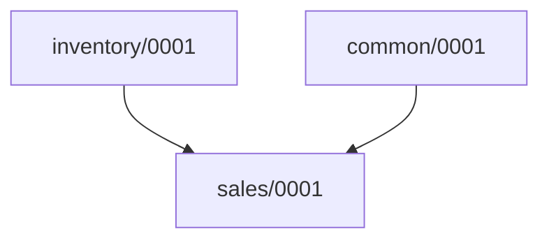

# Usage Guide for migrationgraph

## Overview

The `migrationgraph` management command provides a way to visualize and understand the dependencies between migrations for one or more Django apps. It generates a text representation of the migration graph and produces a MermaidJS flowchart to help visualize the dependencies.

### Command Arguments
- You can run the command without arguments to generate the migration dependencies for **all installed applications**:

`python manage.py migrationgraph`

```{caution}
This command may produce a large amount of output if you have many apps in your project - enough that the MermaidJS graph won't render. Consider specifying one or more app labels to focus on specific apps.
```

- You can also specify one or more application labels to restrict the output to specific apps:

`python manage.py migrationgraph <app_label1> <app_label2>`

Example:

`python manage.py migrationgraph sales inventory`

  This command will display each migration within the `sales` and `inventory` applications, and its forward and reverse dependencies. It will also provide the code to generate a MermaidJS flowchart to visualize the migration graph.

## Output

### Text Output

The command provides a textual representation of each migration in the specified apps, along with its dependencies and dependents. Each migration is listed with:
- The app and migration name.
- Any other migrations it depends on.
- Any migrations that depend on it.

Example output:

```
[sales]
sales/0001_initial
	Depends on:
		common/0001_initial
		inventory/0001_initial

[inventory]
inventory/0001_initial
	Depended upon by:
		sales/0001_initial
```

### MermaidJS Flowchart

The command also generates a **MermaidJS flowchart** to help visualize the migration graph. This flowchart is represented in the MermaidJS syntax, which can be used to generate diagrams.

Example output:

`````
Migrations Flowchart:


`````

To visualize the diagram, copy the MermaidJS output into the [Mermaid Live Editor](https://mermaid.live/) or integrate it into your documentation.

## Notes

- When specifying app labels, ensure they are present in your `INSTALLED_APPS` setting.
- Cross-app dependencies will only be included if the dependent app is specified.

This management command is particularly useful when trying to understand the relationships between different migrations and how they may impact each other, making it easier to plan updates and debugging efforts. It is also helpful in identifying linear migration chains (a set of migrations that depend only on each other) to aid in squashing migrations.
